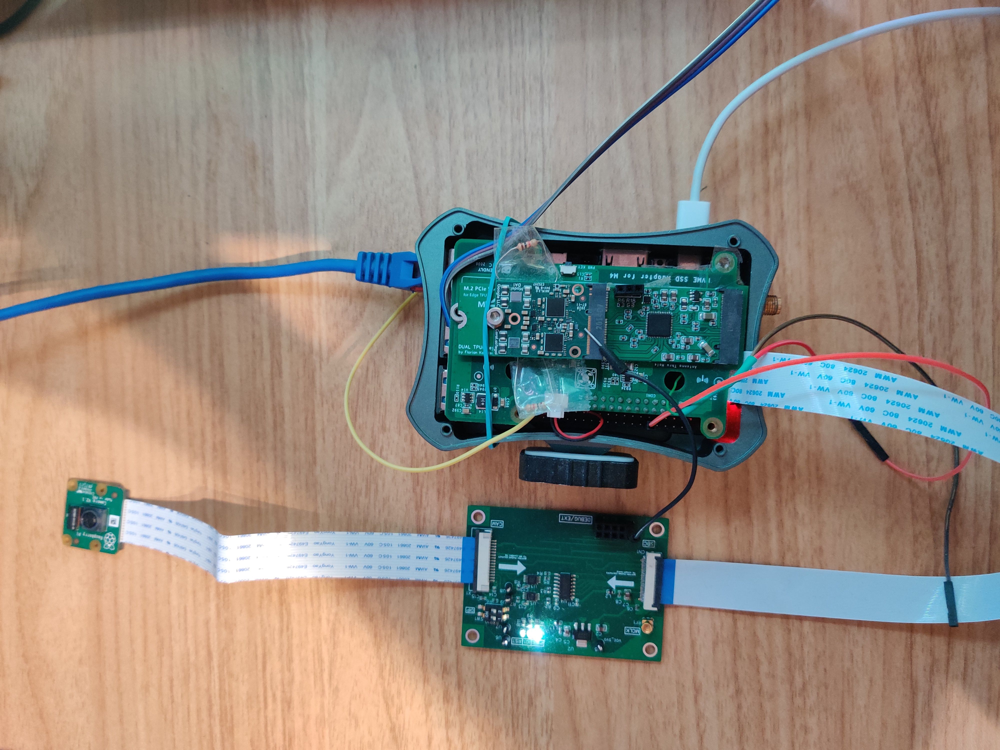

# RK3399_PCIe_Switch_Fix
Simple changes to make Coral Edge Dual TPU work with RK3399 equipped NanoPi M4V2. This was tested with a GNU/Linux Kernel 5.19 build under Armbian. You can include "/src/zV6_gpiod_irq_smp.patch" in your patch-folder on your Armbian build environment. The "z" on the beginning of the filename ensures that it is applied as the last patch in the process.

# Documentation

/doc contains the schematics of the PCIe-adapter board with an ASM1182e Switch IC. This directory also contains a university studies project on the subject (german only).

# Source Code

/src/mymodule.c is just a simple Kernel module for test purposes. You are free to use, modify and redistribute the code in this repository.